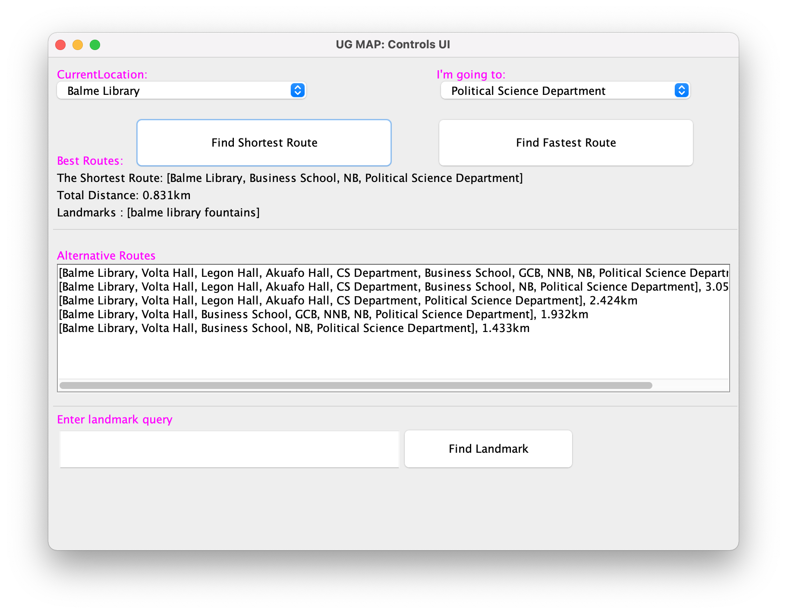

# UG MAP
This is a terminal based app written in Java to desmonstrate the application of Dijkstra and A* algorithms in finding the best route in a graph. 

- First all the vantage places and their relative distances on the campus are modelled in a graph.
- The graph is representation using adjancency list
- The distances among the various places were retrieved from Google Map.
- Dijstrak algorithms was used to find the best route.

